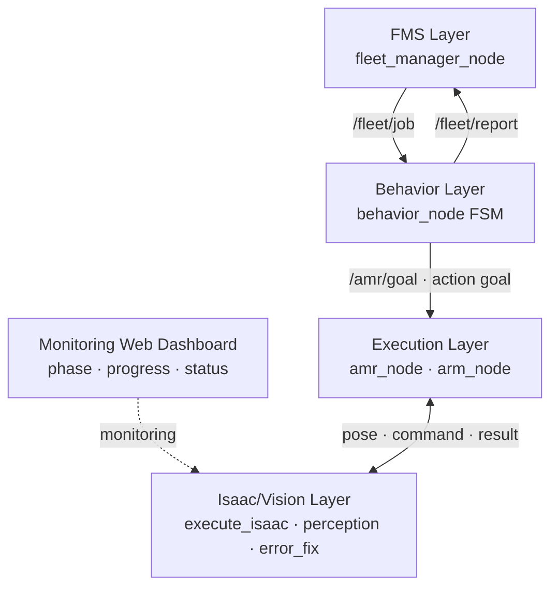

<!--
  Demo asset guide
  - 전체 모니터링 대시보드 시연 영상: assets/demo/202607291149.mp4
  - README 미리보기 GIF: assets/gifs/hmi_full_demo.gif

  두 파일을 추가한 뒤 아래 Demo 섹션의 주석을 해제하면
  GIF를 클릭해 원본 MP4를 재생할 수 있습니다.
-->

<div align="center">

# EV Battery Busbar Assembly Digital Twin

### Vision · AMR · 협동로봇 기반 EV 배터리 버스바 조립 자동화

**Isaac Sim + ROS 2 Humble + Nova Carter + Doosan M0609 + RGB-D Vision + Web Dashboard**


</div>

---

## Demo

이 프로젝트의 전체 공정은 [`isaacpjt/M0609/execute_isaac.py`](./isaacpjt/M0609/execute_isaac.py)
하나로 Isaac Sim에서 실행됩니다. 이 파일이 AMR 이동, 로봇팔 조립, 비전 정렬을
모두 제어하며, 진행 상태를 `/isaac_phase`, `/isaac_progress`, `/isaac_status`
토픽으로 발행해 외부 모니터링 웹 대시보드가 구독할 수 있게 합니다.

<!--
[](./assets/demo/202607291149.mp4)

GIF를 클릭하면 원본 시연 영상이 재생됩니다.
-->

시연 영상에서 확인할 수 있는 전체 흐름은 다음과 같습니다.

```text
대시보드/FMS 작업 시작
→ AMR 배터리 스캔 위치 이동
→ 볼트 2개 및 버스바 검출
→ 버스바 파지
→ 배터리 위치 복귀
→ 비전 기반 미세 오차 보정
→ 버스바 안착
→ 너트 1·2 파지 및 래칫 체결
→ 원점 복귀
→ 대시보드 완료 상태 표시
```

> 현재 저장소에는 시연 영상과 모니터링 웹 대시보드 패키지가 포함되어 있지 않습니다.
> 위 주석에 적힌 경로로 영상/GIF를 추가하면 README 최상단에서 바로 재생할 수
> 있습니다. 이 저장소에 포함된 대시보드 연동 범위는 `/isaac_phase`,
> `/isaac_progress`, `/isaac_status`를 이용한 공정 상태 전달입니다.

---

## 1. Project Overview

이 프로젝트는 **EV 배터리팩의 버스바 배치와 너트 체결 공정을 디지털 트윈
환경에서 자동화**하기 위한 ROS 2 기반 모바일 매니퓰레이터 시스템입니다.

Nova Carter AMR 위에 탑재된 Doosan M0609 협동로봇이 배터리 작업 위치와 부품
공급 위치를 오가며 다음 작업을 수행합니다.

1. RGB-D 카메라로 배터리 볼트와 버스바 위치를 스캔합니다.
2. YOLO Pose 검출 결과와 Depth를 결합해 픽셀 좌표를 3차원 World 좌표로 변환합니다.
3. 2-Finger Gripper로 버스바를 파지해 두 볼트의 중심에 배치합니다.
4. 별도 보정 카메라로 볼트와 버스바 구멍의 픽셀·각도 오차를 반복 보정합니다.
5. 너트 2개를 순서대로 파지하고 회전·하강·재파지하는 래칫 동작으로 체결합니다.
6. 공정 단계, 진행률, 성공/실패 상태를 ROS 2 토픽으로 모니터링 웹 대시보드에 전달합니다.

```text
RGB-D Vision → 3D Pose → FMS/FSM → AMR 이동 → M0609 조립 → 웹 대시보드 모니터링
```

### Core Goal

> “실물 배터리팩에 적용하기 전에 인식·이동·파지·정렬·체결의 전체 공정을
> Isaac Sim에서 검증한다.”

단순한 로봇 모션 데모가 아니라, **Vision 결과가 실제 조립 FSM과 연결되고 작업
결과가 다시 FMS/대시보드로 보고되는 End-to-End 자동화 파이프라인**을 목표로 합니다.

---

## 2. Problem & Motivation

배터리 버스바 조립은 얇은 부품의 파지, 두 볼트에 대한 동시 정렬, 좁은 공차의
삽입, 일정한 체결 깊이와 토크가 모두 필요한 작업입니다.

- 수작업에서는 작업자별 체결 토크와 조립 품질 편차가 발생할 수 있습니다.
- 버스바 구멍과 볼트 축이 조금만 어긋나도 걸림, 충돌, 부품 손상이 발생합니다.
- 나사산 접촉을 PhysX 충돌만으로 재현하면 튕김과 진동 때문에 안정적인 반복
  검증이 어렵습니다.
- 검증되지 않은 로직을 실제 배터리팩에 바로 적용하면 나사산과 고가 부품을
  손상시킬 수 있습니다.

본 프로젝트는 RGB-D Vision, RMPFlow, Kinematic Pose 제어, 물리 파지 및 래칫
체결을 조합하여 이 공정을 실물 배포 전에 검증합니다.

---

## 3. System Architecture



### Layered Architecture

| Layer | Component | Role |
|---|---|---|
| Dashboard | 외부 모니터링 웹 대시보드 / ROS bridge | 공정 단계, 진행률, 성공·실패 상태 표시 |
| FMS | `fleet_manager_node` | 남은 작업 생성, 스테이션별 작업 할당, 결과 수집 |
| Behavior | `behavior_node` | 한 스테이션의 전체 조립 FSM과 작업 순서 제어 |
| Execution | `amr_node`, `arm_node` | AMR 메시지 변환, Arm Action 실행, Vision/Isaac 결과 대기 |
| Perception | `perception_node`, `error_fix_node` | YOLO+Depth 3D 검출, 버스바-볼트 미세 보정 |
| Simulation | `execute_isaac.py` | USD 로드, AMR 이동, RMPFlow, 그리퍼 및 체결 물리 실행 |

### Main Communication Flow

```text
fleet_manager_node
    └─ /fleet/job → behavior_node
         ├─ /amr/goal → amr_node
         │    ├─ /amr/goal_pose → execute_isaac.py
         │    └─ /amr/sim_pose  ← execute_isaac.py
         └─ /execute_arm_task → arm_node
              ├─ /perception/get_bolt_pair → perception_node
              ├─ /perception/get_grasp_pose → perception_node
              ├─ /target_pose, /task_command → execute_isaac.py
              └─ /isaac_phase, /isaac_progress, /isaac_status
                                           ← execute_isaac.py
```

---

## 4. Operation Flow

`behavior_node`는 한 개의 `ASSEMBLE` Job을 받으면 다음 순서로 공정을 수행합니다.

| Step | FSM Task | Description |
|---:|---|---|
| 0 | `MOVE_AMR_BATTERY_SCAN` | AMR을 배터리 스캔 접근 지점으로 이동 |
| 1 | `SCAN_BATTERY` | 초기 자세 정렬 후 볼트 2개의 3D 좌표와 중점 저장 |
| 2 | `MOVE_AMR_BUSBAR` | AMR을 버스바 공급 위치로 이동 |
| 3 | `SCAN_BUSBAR` | 버스바 검출 좌표 저장 |
| 4 | `PICK_BUSBAR` | 상공 접근 → 하강 → Kinematic Pose-Glue 파지 → 상승 |
| 5 | `MOVE_AMR_BATTERY_ASSEMBLY` | 버스바를 파지한 상태로 배터리 위치 복귀 |
| 6 | `MOVE_BATTERY_CENTER` | 검출한 볼트 2개의 중점 상공으로 이동 |
| 7 | `FINE_ALIGNMENT` | 볼트와 버스바 구멍의 XY·각도 오차 반복 보정 |
| 8 | `ASSEMBLE_BUSBAR` | 정렬된 XY를 유지하며 수직 하강, 안착 후 그리퍼 해제 |
| 9 | `SCAN_NUT1` | 너트 스캔 위치 이동 |
| 10 | `PICK_NUT1` | 너트 1 물리 파지 및 상승 |
| 11 | `ASSEMBLE_NUT1` | 볼트 1 착좌 및 회전·하강 래칫 체결 |
| 12 | `SCAN_NUT2` | 너트 스캔 위치 재이동 |
| 13 | `PICK_NUT2` | 너트 2 물리 파지 및 상승 |
| 14 | `ASSEMBLE_NUT2` | 볼트 2 체결 후 초기 관절 자세 복귀 |
| 15 | `SUCCESS / FAILURE` | 결과를 `/fleet/report`로 반환 |

현재 `fleet_manager_node`의 데모 Job은 `station_3 → station_4 → station_5`
순서로 생성됩니다.

---

## 5. Key Features

### RGB-D Vision & 3D Pose

- YOLO Pose 모델로 `bolt`, `busbar`, `nut` 검출
- Keypoint 중심 픽셀과 Depth 값을 이용한 Camera 좌표 역투영
- TF2를 이용한 Camera Frame → World Frame 변환
- 볼트 두 개를 개별 추적한 뒤 중점을 계산하여 버스바 목표 위치 생성
- 최근 2초 표본의 평균·표준편차를 이용한 검출 흔들림 완화
- Bolt ROI와 confidence/IoU threshold를 이용한 오검출 억제
- `/perception/debug_image`로 bbox, keypoint, 3D 좌표 시각화

### Fine Alignment

- 고정 볼트는 Hough Circle로 초기 검출
- 노란색 버스바 영역과 Depth Edge에서 구멍 후보 검출
- 볼트 중심과 버스바 구멍의 픽셀 오차를 0.2 mm 고정 스텝으로 보정
- 버스바와 배터리 에지의 각도 오차 동시 보정
- `0 px` 정렬과 허용 각도 조건을 30회 연속 유지하면 완료 처리

### Busbar Pick & Insert

- 얇은 버스바의 불안정한 마찰 파지를 보완하기 위한 Kinematic Pose-Glue
- 파지 중 버스바 물리를 비활성화하고 EE Pose에 부착
- 접근 → 하강 → 파지 → 상승의 단계별 진행률 발행
- 배터리 상공 이동과 미세 보정 중에도 파지 Pose 유지
- 안착 위치에서 버스바 Pose를 확정한 뒤 그리퍼 개방 및 안전 높이 이탈

### Nut Fastening

- 너트는 2-Finger Gripper로 물리 파지
- 볼트 축 상공 접근 후 저속 수직 하강
- 회전량에 비례해 Z축 체결 깊이를 갱신하는 Kinematic Screwing
- `Rotate → Release → Lift → Unwind → Descend → Regrasp` 래칫 구조
- 6번 조인트 토크와 Z축 정체 횟수를 이용한 완착 조기 판정
- 체결 후 수직 이탈, 손목 되감기, 기본 자세 및 원점 복귀

### AMR & FMS

- 스테이션별 배터리/버스바 접근 좌표 관리
- AMR 이동 중 바퀴 Drive 해제, 로봇팔 작업 중 고강성 브레이크 적용
- AMR 이동 후 RMPFlow가 사용하는 Robot Base Pose 갱신
- Job 단위 성공/실패 보고와 다음 스테이션 작업 할당

### Web Dashboard Monitoring

- 현재 Isaac Phase: `/isaac_phase`
- 서브 작업 진행률: `/isaac_progress`
- 서브 작업 성공/실패: `/isaac_status`
- 모니터링 웹 대시보드가 로봇 내부 구현을 몰라도 표준 ROS 2 토픽으로 상태 표시 가능

---

## 6. Monitoring Dashboard Integration Contract

`execute_isaac.py`는 다음 토픽을 통해 모니터링 웹 대시보드 및 ROS 2 제어 노드와 연동됩니다.

| Direction | Topic | Type | Description |
|---|---|---|---|
| Isaac → Dashboard/Arm | `/isaac_phase` | `std_msgs/String` | 현재 서브 단계 이름 |
| Isaac → Dashboard/Arm | `/isaac_progress` | `std_msgs/Float32` | 현재 서브 작업 진행률(0~100) |
| Isaac → Dashboard/Arm | `/isaac_status` | `std_msgs/String` | `SUCCESS` 또는 `FAILURE:<reason>` |
| Arm/Vision → Isaac | `/task_command` | `std_msgs/String` | 스캔·파지·체결 명령, 정렬 완료 신호 |
| Arm/Vision → Isaac | `/target_pose` | `geometry_msgs/PoseStamped` | 검출 World Pose 또는 미세 보정 Offset |
| Isaac → Error Fix | `/errorfix_command` | `std_msgs/String` | 미세 오차 보정 시작 Trigger |

대시보드 표시용 주요 Phase 예시는 다음과 같습니다.

| Process | Phase Examples |
|---|---|
| Battery Scan | `INIT_ALIGN`, `SCAN_NAV`, `SCAN_COMPLETE` |
| Busbar Pick | `APPROACH`, `DESCEND`, `GRASPING`, `LIFTING`, `COMPLETE` |
| Fine Alignment | `FINE_ALIGNMENT_TRACKING`, `FINE_ALIGNMENT_COMPLETE` |
| Busbar Insert | `BUSBAR_DESCEND_INSERT`, `BUSBAR_RETRACT`, `ASSEMBLE_BUSBAR_COMPLETE` |
| Nut Pick | `NUT_APPROACH`, `NUT_DESCEND`, `NUT_GRASPING`, `NUT_LIFTING` |
| Nut Fasten | `MOVE_TO_BOLT`, `NUT_DESCEND_TO_BOLT`, `NUT_SCREWING`, `NUT_RETRACT_*` |
| Finish | `RETURNING_HOME_JOINTS`, `ASSEMBLE_NUT_COMPLETE` |

> `/isaac_progress`는 전체 공정 누적 진행률이 아니라 **현재 Action의 서브 진행률**입니다.
> 대시보드에서 전체 공정 Progress Bar를 만들 때는 `behavior_node`의 FSM Step과 함께
> 매핑해야 합니다.

> 현재 `main` 브랜치에는 모니터링 웹 대시보드 화면과 Start/Stop Service 구현이 포함되어 있지 않습니다.
> `fleet_manager_node`는 실행 후 데모 Job을 자동 생성하므로, 현재 코드 그대로의 대시보드는
> 우선 모니터링 용도로 연동하는 것이 정확합니다.

---

## 7. Development Environment

| Category | Stack |
|---|---|
| OS | Ubuntu 22.04 LTS |
| ROS | ROS 2 Humble |
| Language | Python 3.10 for external ROS nodes |
| Simulator | NVIDIA Isaac Sim, Standalone Python workflow |
| Motion | RMPFlow |
| Mobile Robot | NVIDIA Nova Carter |
| Cobot | Doosan Robotics M0609 |
| Gripper | OnRobot RG2-style 2-Finger Parallel Gripper |
| Vision | YOLO Pose, Ultralytics, PyTorch, OpenCV, NumPy |
| 3D Geometry | RGB-D, CameraInfo, TF2 |
| Communication | ROS 2 Topic / Service / Action |
| Dashboard | External monitoring web dashboard using phase/progress/status topics |
| Build | colcon, ament_python, ament_cmake |

> 저장소에는 Isaac Sim 버전이 고정되어 있지 않습니다. 사용 중인 버전이
> `from isaacsim import SimulationApp`, `isaacsim.core.*`,
> `isaacsim.robot_motion.*` API와 호환되는지 확인해야 합니다.

---

## 8. Repository Structure

```text
2026_ROKEY_B_1/
├── README.md
├── isaacpjt/M0609/
│   ├── execute_isaac.py              # Isaac Sim 실행 진입점 (모니터링 대시보드용 상태 토픽 발행)
│   ├── Imported_Collected_Busbar_20260728/
│   │   └── Collected_Busbar/         # 현재 실행용 USD 월드와 종속 에셋
│   ├── doosan-robot2/urdf/
│   │   └── m0609_isaac_sim.urdf
│   └── rmpflow/
│       ├── m0609_description.yaml
│       ├── m0609_rmpflow_common.yaml
│       └── m0609_rmpflow_controller.py
└── src/
    ├── fms_interfaces/               # Custom msg/srv/action
    ├── fleet_manager_node/           # Job 생성 및 할당
    ├── behavior_node/                # 전체 조립 FSM
    ├── amr_node/                     # FMS ↔ Isaac AMR bridge
    ├── arm_node/                     # ExecuteArmTask Action server
    ├── perception_node/              # YOLO+Depth 3D perception
    │   └── models/
    ├── error_fix/                    # 버스바-볼트 미세 오차 보정
    ├── dummy_executor_node/          # Isaac 없이 FSM 통신 검증
    └── fms_bringup/                  # 주요 ROS 노드 일괄 실행
```

---

## 9. Prerequisites

### Hardware

- NVIDIA RTX 계열 GPU 권장
- 설치한 Isaac Sim 버전과 호환되는 NVIDIA Driver
- 16 GB 이상 RAM 권장
- GUI 실행 시 충분한 GPU VRAM

### Required Software

1. Ubuntu 22.04
2. ROS 2 Humble Desktop
3. NVIDIA Isaac Sim
4. Git, Python 3, pip, rosdep, colcon
5. Ultralytics, PyTorch, OpenCV, NumPy
6. ROS Vision/TF 패키지
7. 프로젝트용 `Busbar.usd` Scene과 M0609 Mesh
8. 모니터링 웹 대시보드를 사용할 경우 별도 Dashboard Workspace

ROS 2와 Isaac Sim 설치는 각 공식 문서를 먼저 확인하십시오.

- [ROS 2 Humble Ubuntu 설치](https://docs.ros.org/en/humble/Installation/Ubuntu-Install-Debs.html)
- [NVIDIA Isaac Sim ROS 2 설치](https://docs.isaacsim.omniverse.nvidia.com/latest/installation/install_ros.html)
- [Isaac Sim Standalone Python](https://docs.isaacsim.omniverse.nvidia.com/latest/python_scripting/manual_standalone_python.html)

---

## 10. Installation

### 1) Clone

```bash
git clone https://github.com/poi3824/2026_ROKEY_B_1.git
cd 2026_ROKEY_B_1
```

### 2) Install ROS 2 Dependencies

ROS 2 Humble이 이미 설치되어 있다는 기준입니다.

```bash
source /opt/ros/humble/setup.bash

sudo apt update
sudo apt install -y \
  python3-pip \
  python3-rosdep \
  python3-colcon-common-extensions \
  python3-opencv \
  ros-humble-cv-bridge \
  ros-humble-image-geometry \
  ros-humble-tf2-ros \
  ros-humble-tf2-geometry-msgs \
  ros-humble-vision-msgs \
  ros-humble-rqt-image-view
```

`rosdep`을 처음 사용하는 PC에서는 한 번만 초기화합니다.

```bash
sudo rosdep init
rosdep update
```

이미 초기화되어 `sources list file already exists`가 나오면 `rosdep update`만
실행하면 됩니다.

### 3) Install Python Vision Packages

```bash
python3 -m pip install --user --upgrade pip
python3 -m pip install --user ultralytics
```

Ultralytics 설치 시 PyTorch가 함께 설치됩니다. NVIDIA GPU를 사용할 경우에는
로컬 CUDA/Driver 조합과 맞는 PyTorch Wheel인지 별도로 확인하십시오.

> ROS 2 `cv_bridge`를 사용하는 환경에서 pip의 OpenCV/NumPy를 무조건 최신으로
> 올리면 ABI 충돌이 발생할 수 있습니다. `_ARRAY_API`, `multiarray` 관련 오류가
> 발생하면 apt로 설치한 `python3-opencv`와 ROS 2 `cv_bridge` 조합을 우선 사용하고,
> 중복 설치된 pip OpenCV/NumPy 버전을 확인하십시오.

### 4) Install Remaining rosdep Packages

```bash
source /opt/ros/humble/setup.bash
rosdep install --from-paths src --ignore-src -r -y
```

### 5) Build ROS 2 Workspace

```bash
source /opt/ros/humble/setup.bash
colcon build --symlink-install
source install/setup.bash
```

새 터미널을 열 때마다 다음 두 줄을 다시 실행해야 합니다.

```bash
source /opt/ros/humble/setup.bash
source <REPOSITORY_PATH>/install/setup.bash
```

---

## 11. Required Configuration Before Run

이 단계가 완료되지 않으면 `execute_isaac.py`는 정상 실행되지 않습니다.

### 1) Set the USD Scene Path

`execute_isaac.py`는 저장소 내부의 통합 월드를 기본으로 사용합니다.

```python
DEFAULT_USD_PATH = (
    _THIS_DIR / "Imported_Collected_Busbar_20260728"
    / "Collected_Busbar" / "Busbar.usd"
)
```

다른 Scene을 임시로 사용할 때만 환경변수로 지정하십시오.

```bash
ISAAC_WORLD_PATH=/absolute/path/to/Busbar.usd \
  isaac_python isaacpjt/M0609/execute_isaac.py
```

### 2) Restore M0609 Meshes and Fix URDF Paths

`m0609_isaac_sim.urdf`의 Mesh 경로도 개발 PC의 절대경로이며, 참조하는
`meshes/` 폴더는 현재 저장소에 포함되어 있지 않습니다.

```xml
<mesh filename="/home/rokey/.../meshes/m0609_collision/MF0609_0_0.dae" />
```

Doosan M0609 Mesh를 준비한 뒤 모든 `filename`을 실제 경로 또는
`package://` URI로 변경해야 합니다.

### 3) Verify Required USD Prim Paths

Scene의 Prim Path가 다음 값과 일치해야 합니다.

| Object | Required Prim Path |
|---|---|
| Nova Carter Articulation Root | `/World/Nova_Carter/chassis_link` |
| M0609 Root | `/World/m0609` |
| M0609 End Effector | `link_6` |
| Busbar Root / Geometry | `/World/busbar`, `/World/busbar/geo/PolyShape` |
| Nut 1 Root / Geometry | `/World/nut1`, `/World/nut1/geo/PolyShape` |
| Nut 2 Root / Geometry | `/World/nut2`, `/World/nut2/geo/PolyShape` |

Prim 이름이 다르면 `execute_isaac.py` 상단의 경로 상수를 Scene에 맞게
수정하십시오.

### 4) Verify Camera and TF Topics

`perception_node` 기본 입력:

| Topic | Type |
|---|---|
| `/rgb` | `sensor_msgs/Image` |
| `/depth` | `sensor_msgs/Image` |
| `/camera_info` | `sensor_msgs/CameraInfo` |
| `world ← camera_color_optical_frame` | TF |

`error_fix_node` 기본 입력:

| Topic | Type |
|---|---|
| `/camera_bolt/rgb` | `sensor_msgs/Image` |
| `/camera_bolt/depth` | `sensor_msgs/Image` |

Isaac Sim Action Graph 또는 ROS 2 Camera Helper가 위 Topic과 TF를 발행하도록
설정되어 있어야 합니다.

### 5) Check Hard-coded Coordinates

다음 값은 현재 Scene 배치에 맞춘 값입니다.

- `AMR_STATION_POSES`: `behavior_node.py`
- `BOLT1_WORLD_POS`, `BOLT2_WORLD_POS`: `execute_isaac.py`
- `NUT1_OFFSET_FROM_HOME`, `NUT2_OFFSET_FROM_HOME`: `execute_isaac.py`
- `NUT_SUPPLY_TABLE_Z`, `BUSBAR_RELEASE_Z`: `execute_isaac.py`

Scene 배치를 변경했다면 반드시 재측정해야 합니다.

---

## 12. Run — Web Dashboard-linked Full Pipeline

### Terminal A — Run Isaac Sim Standalone

`python3`가 아니라 **설치한 Isaac Sim의 `python.sh`**로 실행합니다.

```bash
export ISAAC_SIM_PATH=/absolute/path/to/isaac_sim

"$ISAAC_SIM_PATH/python.sh" \
  "$(pwd)/isaacpjt/M0609/execute_isaac.py"
```

Headless 실행:

```bash
AMR_HEADLESS=1 "$ISAAC_SIM_PATH/python.sh" \
  "$(pwd)/isaacpjt/M0609/execute_isaac.py"
```

정상 로드되면 다음 로그가 출력되고 ROS 명령을 기다립니다.

```text
Isaac Sim 준비 완료 - BehaviorNode 명령을 대기합니다.
```

> Isaac Sim 버전에 따라 ROS 2 Bridge가 제공하는 Python과 라이브러리 경로가
> 다릅니다. `rclpy` import 오류가 발생하면 해당 Isaac Sim 버전의 ROS 2 Bridge
> 설치 문서를 기준으로 환경을 설정하십시오.

### Terminal B — Run Main Perception

```bash
source /opt/ros/humble/setup.bash
source install/setup.bash

ros2 run perception_node perception_node
```

카메라 Topic 이름이 다르면 Parameter로 변경합니다.

```bash
ros2 run perception_node perception_node --ros-args \
  -p rgb_topic:=/rgb \
  -p depth_topic:=/depth \
  -p camera_info_topic:=/camera_info \
  -p camera_frame_override:=camera_color_optical_frame
```

Debug Image:

```bash
ros2 run rqt_image_view rqt_image_view /perception/debug_image
```

### Terminal C — Run Fine Alignment Vision

GUI 창을 사용하는 노드이므로 Desktop Session에서 실행합니다.

```bash
source /opt/ros/humble/setup.bash
source install/setup.bash

ros2 run error_fix error_fix_node
```

### Terminal D — Run External Monitoring Web Dashboard

모니터링 웹 대시보드 Workspace가 별도로 있다면 해당 Workspace를 Source한 뒤 실행합니다.

```bash
source /opt/ros/humble/setup.bash
source <REPOSITORY_PATH>/install/setup.bash
source <DASHBOARD_WORKSPACE>/install/setup.bash

# 모니터링 웹 대시보드 패키지의 실제 실행 명령 사용
ros2 run <dashboard_package> <dashboard_executable>
```

대시보드는 최소한 다음 Topic을 구독해야 합니다.

```text
/isaac_phase
/isaac_progress
/isaac_status
```

### Terminal E — Start FMS/Behavior/Execution Nodes

`fms_bringup`은 `fleet_manager_node`, `behavior_node`, `amr_node`,
`arm_node`를 실행합니다.

```bash
source /opt/ros/humble/setup.bash
source install/setup.bash

ros2 launch fms_bringup fms_bringup.launch.py
```

> `perception_node`는 현재 Launch 파일에서 주석 처리되어 있으므로 Terminal B에서
> 별도로 실행해야 합니다. `error_fix_node`와 모니터링 웹 대시보드도 별도 실행 대상입니다.

> `fleet_manager_node`는 기동 약 5초 후 `station_3`의 첫 Job을 자동 발행합니다.
> 따라서 Isaac Sim과 Vision 노드를 먼저 정상 실행한 뒤 마지막에 Bringup을
> 시작하십시오.

---

## 13. Connection Check

### Check Nodes

```bash
ros2 node list
```

주요 노드:

```text
/fleet_manager_node
/behavior_node
/amr_node
/arm_node
/perception_node
/battery_assembly_vision_node
/execute_isaac_busar
```

### Check Dashboard Topics

```bash
ros2 topic echo /isaac_phase
ros2 topic echo /isaac_progress
ros2 topic echo /isaac_status
```

### Check Camera Topics

```bash
ros2 topic hz /rgb
ros2 topic hz /depth
ros2 topic echo /camera_info --once
ros2 topic hz /camera_bolt/rgb
ros2 topic hz /camera_bolt/depth
```

### Check TF

```bash
ros2 run tf2_ros tf2_echo world camera_color_optical_frame
```

### Direct Isaac Command Test

전체 FSM을 실행하기 전 통신만 확인할 때 사용합니다.

```bash
ros2 topic pub --once /task_command std_msgs/msg/String \
  "{data: 'SCAN_BATTERY'}"
```

---

## 14. Main ROS 2 Interfaces

### Topics

| Topic | Type | Publisher → Subscriber |
|---|---|---|
| `/fleet/job` | `fms_interfaces/FleetJob` | Fleet Manager → Behavior |
| `/fleet/report` | `fms_interfaces/FleetReport` | Behavior → Fleet Manager |
| `/amr/goal` | `fms_interfaces/AmrGoal` | Behavior → AMR |
| `/amr/status` | `fms_interfaces/AmrStatus` | AMR → Behavior |
| `/amr/goal_pose` | `geometry_msgs/PoseStamped` | AMR → Isaac |
| `/amr/sim_pose` | `geometry_msgs/Pose2D` | Isaac → AMR |
| `/target_pose` | `geometry_msgs/PoseStamped` | Arm/Vision → Isaac |
| `/task_command` | `std_msgs/String` | Arm/Vision → Isaac |
| `/isaac_phase` | `std_msgs/String` | Isaac → Arm/Dashboard |
| `/isaac_progress` | `std_msgs/Float32` | Isaac → Arm/Dashboard |
| `/isaac_status` | `std_msgs/String` | Isaac → Arm/Dashboard |
| `/vision/busbar_grasp` | `fms_interfaces/BusbarGrasp` | Perception → Arm |
| `/vision/nut_pose` | `fms_interfaces/NutPose` | Perception → Arm |
| `/perception/detections_3d` | `vision_msgs/Detection3DArray` | Perception → Debug/Dashboard |
| `/perception/debug_image` | `sensor_msgs/Image` | Perception → rqt/Dashboard |

### Services & Actions

| Name | Type | Role |
|---|---|---|
| `/execute_arm_task` | `fms_interfaces/action/ExecuteArmTask` | Behavior가 Arm 작업 요청 |
| `/perception/get_grasp_pose` | `fms_interfaces/srv/GetGraspPose` | 최신 busbar/nut 3D Pose 요청 |
| `/perception/get_bolt_pair` | `fms_interfaces/srv/GetBoltPair` | 볼트 2개의 안정화된 Pose 요청 |

---

## 15. Main Parameters

### Perception Parameters

| Parameter | Default | Description |
|---|---:|---|
| `rgb_topic` | `/rgb` | RGB Image Topic |
| `depth_topic` | `/depth` | Depth Image Topic |
| `camera_info_topic` | `/camera_info` | Camera Intrinsic Topic |
| `world_frame` | `world` | 출력 3D 좌표 기준 Frame |
| `camera_frame_override` | `camera_color_optical_frame` | TF 조회용 Camera Frame |
| `conf_threshold` | `0.6` | YOLO confidence threshold |
| `iou_threshold` | `0.45` | YOLO IoU threshold |
| `detection_period_sec` | `0.5` | 검출 주기 |
| `grasp_query_max_age_sec` | `5.0` | Service가 허용하는 Cache 최대 나이 |

### Motion & Fastening Parameters

| Constant | Default | Description |
|---|---:|---|
| `AMR_LINEAR_SPEED` | `0.3 m/s` | Kinematic AMR 이동 속도 |
| `AMR_ANGULAR_SPEED` | `1.0 rad/s` | AMR 회전 속도 |
| `INSERT_SPEED` | `0.0005 m/step` | 버스바/너트 수직 하강량 |
| `ENGAGE_LEN` | `0.0125 m` | 목표 체결 깊이 |
| `SCREW_TURNS_DEG` | `350°` | 1 Pass 손목 회전량 |
| `REGRASP_CYCLES` | `1` | 재파지 횟수 |
| `SCREW_OMEGA_DEG_S` | `120°/s` | 체결 회전 속도 |
| `TORQUE_THRESHOLD` | `45.0 Nm` | 완착 조기 판정 토크 |
| `STUCK_STEP_LIMIT` | `12` | Z축 정체 연속 판정 Step |
| `REGRASP_LIFT_HEIGHT` | `0.06 m` | 래칫 재파지 상승 높이 |

이 값은 현재 Scene과 시뮬레이션 튜닝 결과이며, 실제 로봇의 안전 파라미터나 실제
체결 토크 사양으로 사용하면 안 됩니다.

---

## 16. Package-level Run

```bash
# FMS only
ros2 run fleet_manager_node fleet_manager_node

# Behavior FSM only
ros2 run behavior_node behavior_node

# AMR bridge only
ros2 run amr_node amr_node

# Arm Action server only
ros2 run arm_node arm_node

# Main perception only
ros2 run perception_node perception_node

# Fine alignment only
ros2 run error_fix error_fix_node
```

Isaac Sim 없이 FMS/Behavior 통신 구조를 확인할 때:

```bash
ros2 run dummy_executor_node dummy_executor_node
```

---

## 17. Troubleshooting

| Symptom | Cause / Solution |
|---|---|
| `USD 파일을 찾을 수 없습니다` | `execute_isaac.py`의 `USD_PATH`를 실제 `Busbar.usd` 절대경로로 수정 |
| URDF Mesh Load 실패 | `m0609_isaac_sim.urdf`의 절대경로 수정 및 누락된 `meshes/` 복원 |
| `ModuleNotFoundError: isaacsim` | 시스템 `python3`가 아닌 Isaac Sim의 `python.sh` 사용 |
| Isaac에서 `rclpy` import 실패 | 사용 중인 Isaac Sim 버전의 ROS 2 Bridge 환경/내장 라이브러리 설정 확인 |
| 대시보드에 Phase가 표시되지 않음 | `execute_isaac_busar` 노드와 `/isaac_phase` Publisher 확인, `ROS_DOMAIN_ID` 통일 |
| `arm_node`가 계속 대기함 | 이 노드는 Isaac/Vision 응답을 무제한 기다리도록 구현됨. `/isaac_status`와 Perception Service 확인 |
| YOLO가 검출하지 못함 | `/rgb`, `/depth`, `/camera_info`, Model Path, Label(`bolt/busbar/nut`), ROI 확인 |
| 3D 좌표가 발행되지 않음 | `world ← camera_color_optical_frame` TF와 유효한 Depth 확인 |
| Fine Alignment가 시작되지 않음 | `/errorfix_command`와 `/camera_bolt/rgb`, `/camera_bolt/depth` 확인 |
| Fine Alignment가 끝나지 않음 | 0 px 조건을 30회 유지해야 함. HSV, Hough, ROI, 각도 허용치 확인 |
| AMR 도착 처리가 안 됨 | `/amr/goal_pose`, `/amr/sim_pose`, `arrival_tolerance_m` 확인 |
| `_ARRAY_API` / NumPy ABI 오류 | pip/apt OpenCV·NumPy 중복 설치 확인, ROS `cv_bridge`와 호환되는 조합 사용 |
| `cv2.imshow` 관련 오류 | Desktop/`DISPLAY` 환경에서 `error_fix_node` 실행 |

---

## 18. Current Limitations

현재 `main` 브랜치 기준으로 다음 제약이 있습니다.

- 전체 `Busbar.usd` Scene이 저장소에 포함되어 있지 않습니다.
- M0609 URDF가 참조하는 Mesh와 일부 절대경로가 저장소 외부 환경에 의존합니다.
- 모니터링 웹 대시보드와 Start/Stop 제어 패키지는 저장소에 포함되어 있지 않습니다.
- `fms_bringup.launch.py`에서 `perception_node`가 주석 처리되어 있습니다.
- `fleet_manager_node`는 실제 잔여 작업 인식 대신 station 3~5 데모 Job을 생성합니다.
- AMR은 `set_world_pose` 기반 Kinematic 이동이며 Nav2/바퀴 물리 주행이 아닙니다.
- 너트 공급 위치와 볼트 체결 좌표 일부가 Scene 기준으로 하드코딩되어 있습니다.
- 너트 스캔 단계가 존재하지만 현재 Pick 좌표는 Home 기준 Offset을 사용합니다.
- 체결 토크는 실제 센서가 아니라 Isaac Sim Joint Effort 기반 값입니다.
- 실물 로봇 Safety I/O, Collision Stop, Emergency Stop은 별도 구현이 필요합니다.

---

## 19. Future Work

- 모니터링 웹 대시보드 패키지와 Start/Stop/E-Stop Service를 저장소에 통합
- 전체 공정 누적 Progress와 작업 이력 Dashboard 구현
- USD Scene, Robot Mesh, Configuration 경로의 Portable Packaging
- YAML 기반 Station/Bolt/Nut 좌표 관리
- 너트 Pick/체결 위치의 완전한 Vision 기반 전환
- AMR Nav2 또는 PhysX Wheel Drive 적용
- Force/Torque 기반 Compliance와 Cross-thread 방지 로직 강화
- 실패 시 `Stop → Retreat → Re-scan → Retry` Recovery FSM 구현
- 체결 성공률, 위치 오차, 작업 시간, 토크-각도 데이터 자동 저장
- 실제 Doosan M0609 및 2-Finger Gripper 연동

---

## 20. Acknowledgement

본 프로젝트는 Doosan Robotics ROKEY 지능형 로보틱스 엔지니어 과정의
협동로봇 프로젝트로 수행되었습니다.

README 구성은
[`2026_ROKEY_Vision-Regent-Cobot`](https://github.com/jiwan1230/2026_ROKEY_Vision-Regent-Cobot)의
프로젝트 소개, 아키텍처, 실행 가이드 형식을 참고하되, 본 저장소의 실제
`execute_isaac.py`와 ROS 2 노드 구현을 기준으로 재작성했습니다.
